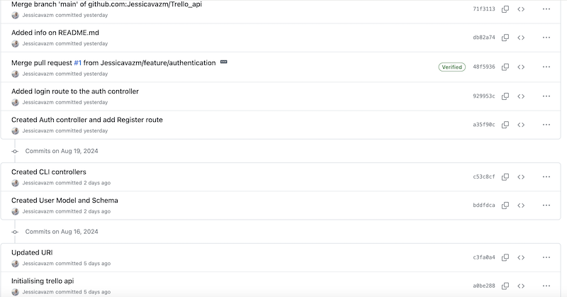

# JessicaVaz_T3A1

# Q1 
During our course, we have been using GIT as it's widely known and it's a very popular choice for managing code and keeping track of code changes. Apart from Git, other common source control programs are Mercurial and Subversion. When using source control for a large project, we want to ensure the GIT covers all features, and also includes the documentation as it's very important in all scale programs. The repository is hosted on the platform GitHub which offers plenty of features including branch merge, code comparison and code collaboration.

The first step is to initialise a repository in the main or master branch, which will store the project's source code and it's files. When initialising the repository, we also need to add the README.md file which contains the project's documentation. README.md file contains all of the information about the program including name and description, table of contents, all the steps required to run the application, the usage cases, the tech stacked used to build the program, contribution guidelines, license information and plenty more. The gitignore template is another option we can add when initialising the project, this file will contain all the files git should ignore when pushing content to the repository.

Through the building process, different branches are created to allow developers to work on different features independently without code conflicts. It's recommended to create a different branch for each feature as this allows independently testing and experimenting without compromising the rest of the code. When creating news branches for specific features, the conventional name used is <b>feature</b>, this ensure a clear description of what's the purpose of the extra branch. Name example bellow:

    feature/authentication

With every commit, we should include meaningful messages to describe what changes has been added or changes. A good practise to have the type of commit before the message, they provide extra details for the commit messages. Other good practices includes keeping the message short and clear.

Examples of conventional commit bellow:
* git commit -m "docs: added a brief description" 
* git commit -m "feat: added a JWT to auth" 
* git commit -m "fix: fixed a bug in user auth fn" 
* git commit -m "test: test done in user's auth" 

Once all the testing has been done and the code works as it supposed, features branches can be merged into the main branch, which stores source code and production ready code. Features branches can also be deleted safely after being merged, however this is optional. The first step to merge the branch is to perform a pull request. A pull request contains information describing the branch's purpose, and it's code. Developers working in the projects can review the code, suggest improvements, provide feedback and ensure it doesn't have any conflicts with other existing branches. In case of an existing conflict, developers are required to solve the conflict first in order to proceed with the pull request. Another good feature is that Github makes it possible to assign reviewers and assignees to each branch or pull request. This ensures a structured review process and accountability for code quality.

When all required tasks and requirements has been reached, the pull request will be ready to merge. Once the process is done, an acknowledgement message will be provided and all of the content from the extra branch will be merged into the main branch. Once all branches has been merged, and the code is working as it should, the code will be ready for deployment.

#### Git commits and pull requests example
Example of source control process from my past project in term 2 in Coder Academy.

References:

Workbook assignment: JessicaVaz_T2A1-A

freeCodeCamp.org. (2022). How to Write Better Git Commit Messages – A Step-By-Step Guide. [online] Available at: https://www.freecodecamp.org/news/how-to-write-better-git-commit-messages/.

# Q2
Quality aspects ensure the quality of a software, how functional and well-structured the application is. Every software should aim to incorporate the quality aspects in order to deliver a better user experience. Softwares can be measured based on a group of aspects or on a singular aspect. 

Some of the most important aspects are listed bellow with a brief description on each of them:

#### Usability
User usability is a very important aspect, as it determines the overall software success. Softwares should be easy to navigate, preferably it should not require much training and it should require the minimum amount of clicks to perform a task. Another very important aspect is that softwares should consider and accommodate users with different disabilities. Ways to ensure this aspect is successful is collecting user stories, having an user product owner in place and ensuring designs are visually appealing and engaging without overwhelming the users.

#### Functionality
Software functionality is another very important aspect as the software should be able to perform the intended functions and offer the users all the functions needed to perform a specific task. Software developers are responsible for the software functionalities.

#### Code Quality
Software codes should be written in an efficient way, without bugs and semantically correct. Developers should follow the best practices and adherence to standards to ensure high quality code.

#### Reliability 
Software should be able to handle errors gracefully without crashing or losing data. It must perform all tasks given different conditions. Mean Time Between Failure and Mean Time To Repair measurements can be used to check reliability aspect.

#### Maintainability
Developers should prioritise code maintainability to adapt to evolving user needs, as software must keep pace. The codebase should be structured for easy updates, allowing developers to implement changes, fix bugs, and add new features. 

#### Integrity
Integrity aspect shows how easy the software can integrate with the dependant softwares in order to increase functionality.

#### Security
Security is also on the top of the list, users must have their data protected when using the software. Software security ensures software is protected against cyber crimes, and have methods in place to protect users in case of cyber attacks. Measurements such as authentication and authentication can greatly reduce the risk of cyber crimes. Another important practise is to regularly implement security checks to ensure software is often protected. Regular checks also can prevent a future security breach.

#### Testability
This indicates how easy the software allows testers to perform testing on the software, how long does it takes to write a testing for the specific software, and how much time it needs to run the testing. One way to reduce costs here is for developers to perform unit and integration testing during the development stage before testers comes into place.  

### Photo example of software quality aspects

References:

Codoid (2019). The Basics of Software Quality Attributes. [online] Codoid. Available at: https://codoid.com/software-testing/the-basics-of-software-quality-attributes/.

Butinar, M. (2023). Don’t Save on Quality: Essential Attributes of Good Software. [online] Available at: https://biosistemika.com/blog/dont-save-on-quality-key-attributes-of-software/.

‌VM. (2023). 15 Key Factors for High-Quality Software. [online] Available at: https://vmsoftwarehouse.com/15-key-factors-for-high-quality-software.

‌
# Q3	
Outline a standard high level structure for a MERN stack application and explain the components

# Q4	

#### Front end and Back end
Web developers are divided in two groups front and back end. Front end developers will be working with everything that is displayed on the browser itself and the Backend developer will work with logic and technical side of the website(this includes APIS and DB). Together, they write the codes that *creates* the website allowing it to be displayed on a browser. Some of the most important skills and knowledge they need in order to create a website includes:

- HTML: to define the website structure.
- CSS: to style the website.
- Javascript: to create the interactive content for the website.
- Server-side languages: Python, Nodejs to manage data, and create integration.
- Version control system: GIT, to track code changes and allow collaborations between developers.
- Flask: Python's micro web frame used to create API.
- PostgreSQL: to manage, store and retrieve data.
- SQLAlchemy: ORM to connect DB to API.

### Design 
UX/ UI designers to ensure positive user's experience while navigating the website. User Interface (UI) designers ensure the elements that users interact directly on the website such as menus and buttons are easy to navigate, clear and visually appealing. User Experience (UX) designers ensure the overall flow on the website is enjoyable and functional. Web designer is also required to create the designs on the website and represent the 'brand' online. 

### Testing
QA engineers are responsible for testing the application and ensuring the application is free of bugs and errors. They ensure website works as it's supposed to and the application quality has passed the requirements. QA are also responsible for creating reports about the website's usability to ensure better user's experience.

### Management
A product manager who will overview the website project is also required. This person will be responsible for coordinating the team, assigning tasks accordingly with each person's set of skills, set goals and deadlines for the team and assist them through the process. 

Project managers should have familiarity with project management tools such as Trello, Jira and Agile/ Scrum expertise. Apart from this, having familiarity with the other aspects of the project including development stages, testing stages would be highly beneficial.

References:

Workbook assignment: JessicaVaz_T2A1-A

Rightpeoplegroup.com. (2024). How to build the ideal website development team structure. [online] Available at: https://rightpeoplegroup.com/blog/how-to-build-the-ideal-website-development-team-structure.

# Q5	
With reference to one of your own projects, discuss what knowledge or skills were required to complete your project, and to overcome challenges

# Q6	
With reference to one of your own projects, evaluate how effective your knowledge and skills were for this project, and suggest changes or improvements for future projects of a similar nature

# Q7	
Explain control flow, using an example from the JavaScript programming language

# Q8	
Explain type coercion, using examples from the JavaScript programming language

# Q9	
Explain data types, using examples from the JavaScript programming language

# Q10	
Explain how arrays can be manipulated in JavaScript, using examples from the JavaScript programming language

# Q11	
Explain how objects can be manipulated in JavaScript, using examples from the JavaScript programming language

# Q12	
Explain how JSON can be manipulated in JavaScript, using examples from the JavaScript programming language